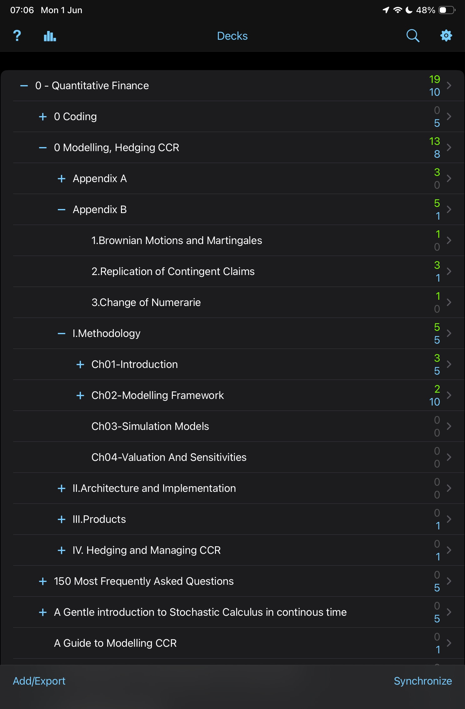

# ☀️ 1st June 2026 - Monday

## 📚 Anki

- Reviewed . Mainly [[Modelling-Pricing-and-Hedging-Counterparty-Credit-Exposure]] and the idea of Stochastic exponential.
- Wrote a note on the [[stochastic-exponential]]: derived why $e^{W_t}$ drifts via Itô's lemma, constructed $e^{W_t - \frac{1}{2}t}$ as the true martingale, and connected it to the Doléans-Dade exponential $\mathcal{E}(W)_t$.

#anki

---

[Modelling-Pricing-and-Hedging-Counterparty-Credit-Exposure]: ../../../books/Modelling-Pricing-and-Hedging-Counterparty-Credit-Exposure.md "Modelling CCR"
[stochastic-exponential]: ../../../notes/random-notes/stochastic-exponential.md "Stochastic Exponential"
