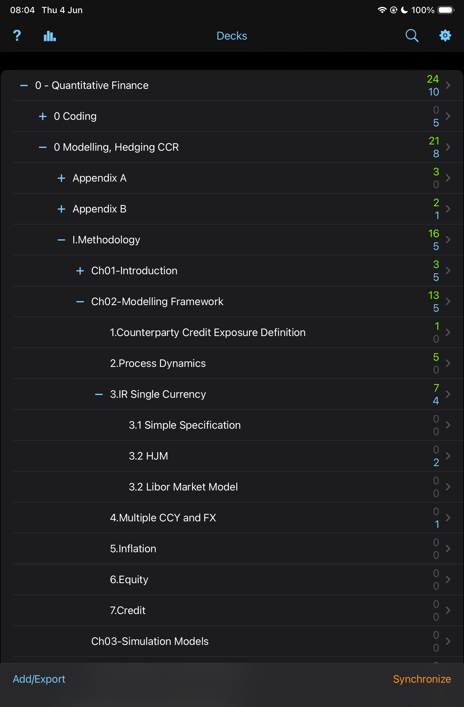

# ☀️ 4th June 2026 - Thursday

## 📚 Anki

- Reviewed cards. Focusing on [[Modelling-Pricing-and-Hedging-Counterparty-Credit-Exposure]].

#anki

---

## 👨🏾‍💻 Coding

- Started the developing in c++ [monteCarloEngine.h](/code/cpp/src/monteCarloEngine.h). Having Claude as a teacher and asking questions makes the process much more efficient for understanding.

#coding

---

## 🧭 Exploring

- Update the [[CLAUDE]] for the equity deep dive project.

#exploring

---

---

[Modelling-Pricing-and-Hedging-Counterparty-Credit-Exposure]: ../../../books/Modelling-Pricing-and-Hedging-Counterparty-Credit-Exposure.md "Modelling CCR"
[CLAUDE]: ../../../CLAUDE.md "Quant Journal — Claude Context"
