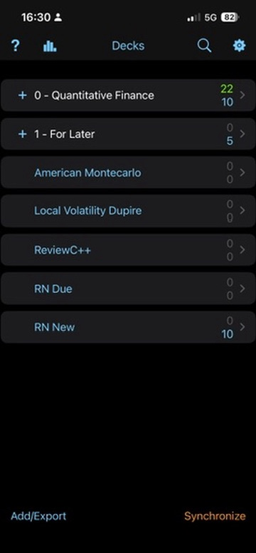

# ☀️ 6th June 2026 - Saturday

## 📚 Anki

- Reviewed Anki for [[Modelling-Pricing-and-Hedging-Counterparty-Credit-Exposure]]

#anki

## 👨🏾‍💻 Coding

- Continued building [monteCarloEngine.hpp](/code/cpp/src/monteCarloEngine.hpp) and [monteCarloEngine.cpp](/code/cpp/src/monteCarloEngine.cpp). Not using *structure binding* anymore because they are based on position not on name. Very dangerous I think.

- Added test [monteCarloEngine](/code/cpp/tests/unit/monteCarloEngine.cpp) for case where volatility is zero so value is deterministic. See [[gbm-expectation]].

#coding

---

## 🧭 Exploring

- Continued with the general overview of [[Modern-Computational-Finance-AAD-and-Parallel-Simulations]]. Completed Chapter 2 (smart pointers, RAII pattern). Started Chapter 3: thread pool architecture, condition variables, false sharing and cache lines, mutexes with lock_guard, and atomics. Next: spinlocks

#exploring

---

[Modelling-Pricing-and-Hedging-Counterparty-Credit-Exposure]: ../../../books/Modelling-Pricing-and-Hedging-Counterparty-Credit-Exposure.md "Modelling CCR"

[Modern-Computational-Finance-AAD-and-Parallel-Simulations]: ../../../books/Modern-Computational-Finance-AAD-and-Parallel-Simulations.md "Modern Computational Finance"

[gbm-expectation]: ../../../notes/random-notes/gbm-expectation.md "GBM Expectation Under Risk-Neutral Measure"
