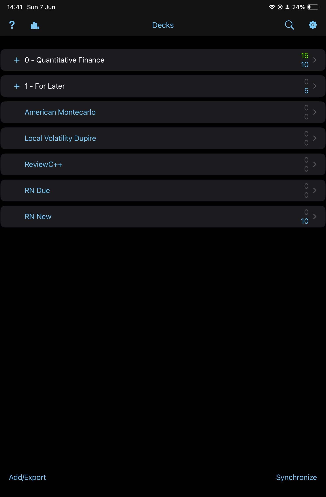

# ☀️ 7th June 2026 - Sunday

## 👨🏾‍💻 Coding

- Completed unit tests for [monteCarloEngine](/code/cpp/tests/unit/monteCarloEngine.cpp): fixed seed + positive vol (mean check with 3×SE margin), no-seed structural checks, parameterised `validateGbmInputs` tests with `REQUIRE_THROWS_AS`.
- Replaced `assert` preconditions in `simulateGbmPath` with `std::invalid_argument` exceptions following QuantLib convention. Extracted `validateGbmInputs` as a separate function.
- Set up CMake build system (`CMakeLists.txt`): `quantJournal` static library, `monteCarloEngineUnit` test executable, Catch2 integration, CTest registration, Debug build type.
- Configured VS Code: TestMate C++ for test discovery and debugging, task buttons for Build Lib / Build Tests / Run Coverage, `launch.json` for debugger.
- Added LLVM coverage pipeline: `run_test_with_coverage.sh` script + `Coverage` build type in CMake generating HTML report.
- Started [vanillaEuropeanOption.cpp](/code/cpp/src/product/vanillaEuropeanOption.cpp) and [vanillaEuropeanOption.hpp](/code/cpp/src/product/vanillaEuropeanOption.hpp): `priceEuropeanVanillaOption` MC pricer with call/put and long/short support.

#coding

## 📚 Anki

- Reviewed cards. Focusing on [[Modelling-Pricing-and-Hedging-Counterparty-Credit-Exposure]].

#anki

---
---

[Modelling-Pricing-and-Hedging-Counterparty-Credit-Exposure]: ../../../books/Modelling-Pricing-and-Hedging-Counterparty-Credit-Exposure.md "Modelling CCR"
