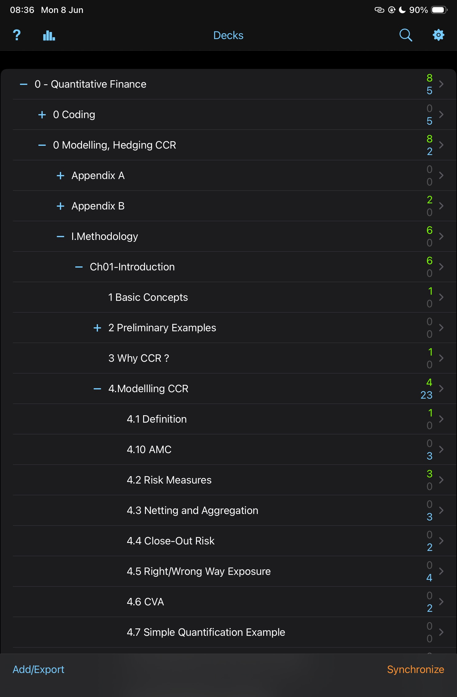

# ☀️ 8th June 2026 - Monday

## 📚 Anki

- Reviewed cards. Focusing on [[Modelling-Pricing-and-Hedging-Counterparty-Credit-Exposure]].

#anki

---

## 👨🏾‍💻 Coding

- Refactored `priceEuropeanVanillaOption` in [vanillaEuropeanOption.cpp](/code/cpp/src/product/vanillaEuropeanOption.cpp): replaced `if/else` with `switch` on `enum class` for both `OptionType` and `OptionDirection`. Added `default` throw following QuantLib convention.
- Added unit tests in [vanillaEuropeanOption.cpp (tests)](/code/cpp/tests/unit/product/vanillaEuropeanOption.cpp): put-call parity (long + short), negative strike validation, invalid `OptionType` and `OptionDirection` via `static_cast`. Reached 100% line/region coverage.
- Extended CMake coverage pipeline and TestMate config to include `vanillaEuropeanOptionUnit`.

#coding

---

[Modelling-Pricing-and-Hedging-Counterparty-Credit-Exposure]: ../../../books/Modelling-Pricing-and-Hedging-Counterparty-Credit-Exposure.md "Modelling CCR"
